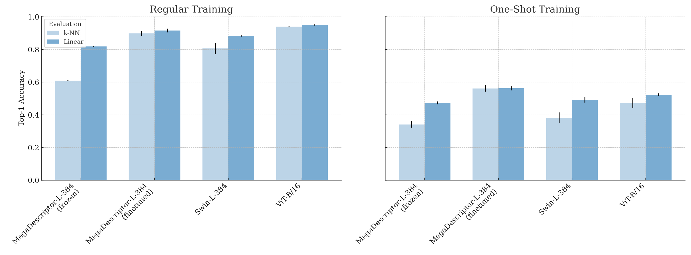

# 🐔 Chicks4FreeID
The very first publicly available chicken re-identification dataset
is available on 🤗 **Hugging Face**: [huggingface.co/datasets/dariakern/Chicks4FreeID](https://huggingface.co/datasets/dariakern/Chicks4FreeID)


## 🤗 Usage

> ```shell
> pip install datasets
> ```

Load the data:
```python
from datasets import load_dataset
train_ds = load_dataset("dariakern/Chicks4FreeID", split="train")
train_ds[0]
```

Output: 
> ```python
> {'crop': <PIL.PngImagePlugin.PngImageFile image mode=RGB size=2630x2630 at 0x7AA95E7D1720>,
> 'identity': 43}
> ```

> [!TIP]
> Find more information on how to work with 🤗  [huggingface.co/docs/datasets](https://huggingface.co/docs/datasets/v2.19.0/index)


## 📊 Baseline

To establish a baseline on the dataset, we explore 4 approaches

1. We evaluate the SotA model in animal re-identification: MegaDescriptor-L-384, a feature extractor, pre-trained on many species and identities. 
   
   `timm.create_model("hf-hub:BVRA/MegaDescriptor-L-384", pretrained=True)`
2. We finetune the above MegaDescriptor-L-384. 
   
   `timm.create_model("hf-hub:BVRA/MegaDescriptor-L-384", pretrained=True)`
3. We train MegaDescriptor-L-384's underlying architecture; a Swin-Transformer, in the same way it has been used to build the MegaDescriptor-L-384, but now on our own dataset. (MegaDescriptor from scratch)
   
   `timm.create_model('swin_large_patch4_window12_384')`
4. We train a Vision Transformer (ViT-B/16) as a fully supervised baseline, and focus on embeddings by replacing the classifier head with a linear layer.
   
   `from torchvision.models import vit_b_16`

Evaluation settings are based on:

- Linear Eval: [SimCLR](https://dl.acm.org/doi/abs/10.5555/3524938.3525087)
- k-NN Eval: [InstDist](https://doi.org/10.1109/CVPR.2018.00393)

Metrics are from torchmetrics 

- mAP: `MulticlassAveragePrecision(average="macro")`
- top1: `MulticlassAccuracy(top_k=1)`
- top5: `MulticlassAccuracy(top_k=5)`

We train on the all-visibility subset of the Chicks4FreeID dataset. Better results can be achieved by only training on the best-visibility subset. The All-visibility subset contains images where chicken might be occluded or cut off. The best-visibility subset only contains chicken that are fully and clearly visibile.
Below are the metrics for all-visibility test set. Standard deviations are based on 3 runs:





#### Regular Training (200 Epochs)

| Setting                            | Evaluation         | val_mAP       | val_top1      | val_top5      |
|:-----------------------------------|:-------------------|:--------------|:--------------|:--------------|
| MegaDescriptorL384 Frozen          | knn_eval           | 0.563 ± 0.011 | 0.609 ± 0.006 | 0.920 ± 0.025 |
| MegaDescriptorL384 Frozen          | linear_eval        | 0.920 ± 0.008 | 0.818 ± 0.002 | 0.976 ± 0.003 |
| MegaDescriptorL384 Finetune        | knn_eval           | 0.835 ± 0.035 | 0.898 ± 0.026 | 0.976 ± 0.006 |
| MegaDescriptorL384 Finetune        | linear_eval        | 0.960 ± 0.009 | 0.916 ± 0.020 | 0.982 ± 0.007 |
| SwinL384                           | knn_eval           | 0.728 ± 0.082 | 0.806 ± 0.060 | 0.966 ± 0.013 |
| SwinL384                           | linear_eval        | 0.945 ± 0.019 | 0.884 ± 0.010 | 0.989 ± 0.004 |
| ViT_B_16                           | knn_eval           | 0.923 ± 0.006 | 0.939 ± 0.006 | 1.000 ± 0.000 |
| ViT_B_16                           | linear_eval        | 0.970 ± 0.014 | 0.951 ± 0.009 | 1.000 ± 0.000 |


#### One-Shot Training (only one image per identity was used for training, 200 Epochs)

| Setting                            | Evaluation         | val_mAP       | val_top1      | val_top5      |
|:-----------------------------------|:-------------------|:--------------|:--------------|:--------------|
| MegaDescriptorL384 Frozen          | knn_eval           | 0.298 ± 0.035 | 0.341 ± 0.034 | 0.632 ± 0.037 |
| MegaDescriptorL384 Frozen          | linear_eval        | 0.522 ± 0.013 | 0.473 ± 0.015 | 0.797 ± 0.014 |
| MegaDescriptorL384 Finetune        | knn_eval           | 0.464 ± 0.035 | 0.561 ± 0.034 | 0.782 ± 0.022 |
| MegaDescriptorL384 Finetune        | linear_eval        | 0.645 ± 0.027 | 0.562 ± 0.022 | 0.818 ± 0.036 |
| SwinL384                           | knn_eval           | 0.289 ± 0.057 | 0.382 ± 0.058 | 0.620 ± 0.076 |
| SwinL384                           | linear_eval        | 0.545 ± 0.039 | 0.492 ± 0.030 | 0.726 ± 0.015 |
| ViT_B_16                           | knn_eval           | 0.387 ± 0.044 | 0.473 ± 0.051 | 0.785 ± 0.013 |
| ViT_B_16                           | linear_eval        | 0.619 ± 0.020 | 0.523 ± 0.014 | 0.808 ± 0.012 |


## 🧑‍💻 Replicate the baseline

```shell
git clone https://github.com/DariaKern/Chicks4FreeID
cd Chicks4FreeID
pip install requirements.txt
python run_baseline.py
```

To change the experiment configuration, modify the config in run_baseline.py.
Available configuration options:


```python
class Config:
    batch_size_per_device: int = 16
    epochs: int = 200
    num_workers: int = 4
    checkpoint_path: Optional[Path] = None
    num_classes: int = 50
    skip_embedding_training: bool = False
    skip_knn_eval: bool = False
    skip_linear_eval: bool = False
    methods: Optional[List[str]] = None
    dataset_subsets: Optional[List[str]] = field(default_factory= lambda: ["chicken-re-id-all-visibility"]) 
    accelerator: str = "auto"
    devices: int = 1
    precision: str = "16-mixed"
    test_run: bool = False
    check_val_every_n_epoch: int = 5
    profile= None  # "pytorch"
    aggregate_metrics: bool = False
    one_shot: bool = False 
```


In a sepearte shell, open tensorboard to view progress and results

```shell
tensorboard --logdir chicken-re-id-all-visibility
```

> [!NOTE]
> Differnt low-level accelerator implementations (TPU, MPS, CUDA) yield different results. The original hardware config for the reported results is based on the MPS implementation accessible on a 64GB Apple M3 Max chip (2023) 💻 - it is recommened to run the baseline script with at least 64GB of VRAM / Shared RAM. On this device, one run takes around `9:30h`


## ⏳ Timeline
- [2024 Dec 24] 🎄🎁 Paper published in Animals Special Issue Automated Monitoring of Livestock and Poultry with Machine Learning Technology, Volume II [https://doi.org/10.3390/ani15010001](https://www.mdpi.com/2076-2615/15/1/1)
- [2024 Nov 05] Pushed updated results
- [2024 Oct 26] Chicks4FreeID is now part of the wildlife datasets project [https://github.com/WildlifeDatasets/wildlife-datasets](https://github.com/WildlifeDatasets/wildlife-datasets)
- [2024 May 30] DOI created: [https://doi.org/10.57967/hf/2345](https://doi.org/10.57967/hf/2345) 
- [2024 May 23] the first version of the dataset was uploaded to Hugging Face. [https://huggingface.co/datasets/dariakern/Chicks4FreeID](https://huggingface.co/datasets/dariakern/Chicks4FreeID)


## 📝 Papers and systems citing the Chicks4FreeID dataset
coming soon ...

## 🖋️ Citation 
```tex
@Article{ani15010001,
AUTHOR = {Kern, Daria and Schiele, Tobias and Klauck, Ulrich and Ingabire, Winfred},
TITLE = {Towards Automated Chicken Monitoring: Dataset and Machine Learning Methods for Visual, Noninvasive Reidentification},
JOURNAL = {Animals},
VOLUME = {15},
YEAR = {2025},
NUMBER = {1},
ARTICLE-NUMBER = {1},
URL = {https://www.mdpi.com/2076-2615/15/1/1},
ISSN = {2076-2615},
DOI = {10.3390/ani15010001}
}
```
