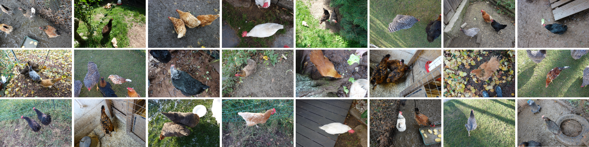

# 🐔 Chicks4FreeID
The very first publicly available chicken re-identification dataset
is available on 🤗 **Hugging Face**: [huggingface.co/datasets/dariakern/Chicks4FreeID](https://huggingface.co/datasets/dariakern/Chicks4FreeID)




## 🤗 Usage

```shell
pip install datasets
```

```python
from datasets import load_dataset
train_ds = load_dataset("dariakern/Chicks4FreeID", split="train")
train_ds[0]
```

```python
{'crop': <PIL.PngImagePlugin.PngImageFile image mode=RGB size=2630x2630 at 0x7AA95E7D1720>,
 'identity': 43}
```


> [!TIP]
> Find more information on how to work with 🤗 datasets [here]()


## 📊 Baseline

COMING SOON


## 🧑‍💻 Replicate the baseline

```shell
git clone https://github.com/DariaKern/Chicks4FreeID
cd Chicks4FreeID
pip install requirements.txt
python run_baseline.py
```

You can pass different options, depending on your hardware configuration

```shell
python run_baseline.py --devices=4 --batch-size-per-device=128 
```

For a full list of arguments type

```shell
python run_baseline.py --help
```

In a sepearte shell, open tensorboard to view progress and results

```shell
tensorboard --logdir baseline_logs
```

> [!IMPORTANT]
> Differnt low-level accelerator implementations (TPU, MPS, CUDA) yield different results. The original hardware config for the reported results is based on the MPS implementation accessible on a 64GB Apple M3 Max chip (2023) 💻 - it is recommened to run the baseline script with at least 64GB of VRAM / Shared RAM.


## ⏳ Timeline
- [2024/05/30] DOI created: [https://doi.org/10.57967/hf/2345](https://doi.org/10.57967/hf/2345) 
- [2024/05/23] the first version of the dataset was uploaded to Hugging Face. [https://huggingface.co/datasets/dariakern/Chicks4FreeID](https://huggingface.co/datasets/dariakern/Chicks4FreeID)

## 📝 Papers and systems citing the Chicks4FreeID dataset
coming soon ...

## 🖋️ Citation 
```tex
@misc{kern2024Chicks4FreeID,
      title={Chicks4freeID: A Benchmark Dataset for Chicken Re-Identification}, 
      author={Daria Kern and Tobias Schiele and Ulrich Klauck and Anjali DeSilva and Winfred Ingabire},
      year={2024},
      doi={https://doi.org/10.57967/hf/2345},
      note={in preparation for NeurIPS 2024 Datasets and Benchmarks Track}
}
```
